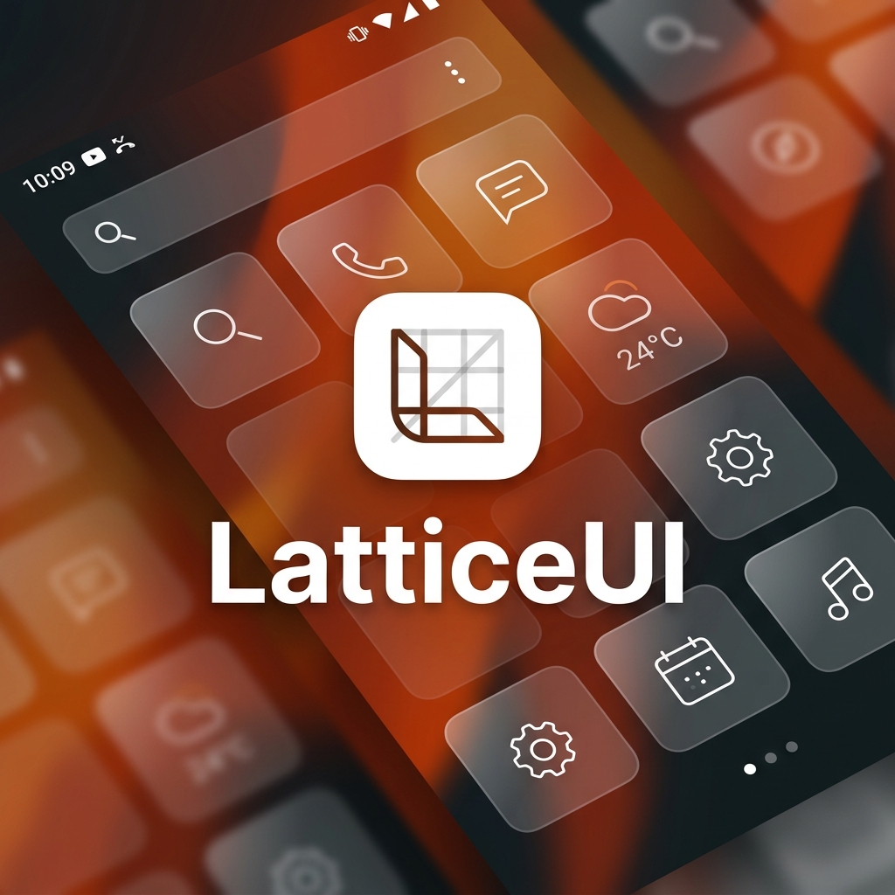

# Lattice UI

A beautiful, productivity-focused Android Home Launcher built dynamically with the Godot Engine.

## Features
- **Dynamic Background Blur:** Seamlessly captures your system wallpaper and applies a stunning, frosted-glass blur effect across the entire launcher interface.
- **Icon Pack Support:** Fully supports third-party Android icon packs so you can customize your home screen aesthetic exactly to your liking.
- **Productivity Focused:** Clean, minimalist, and designed to keep you focused on what matters.
- **Performance First:** Leverages the raw rendering power of the Godot Engine and Android's native BLAST BufferQueue for silky smooth 60/120fps frame pacing and zero-lag animations.

## How to Install
1. Go to the **[Releases](../../releases/latest)** page.
2. Download the `LatticeUI-Release.apk` file to your phone.
3. Open the APK and tap **Install**. (If prompted, allow installation from unknown sources).
4. Go to your phone's **Settings -> Apps -> Default Apps -> Home app** and select **LatticeUI**.

*Note: On Android 13+, to enable Usage Access for the app drawer, go to Settings -> Apps -> LatticeUI -> tap the 3 dots in the top right -> select "Allow restricted settings".*

## Privacy
Lattice UI runs entirely locally on your device. It does not collect, store, or transmit any personal data. Usage stats are processed purely on-device to power the app drawer's smart sorting.
